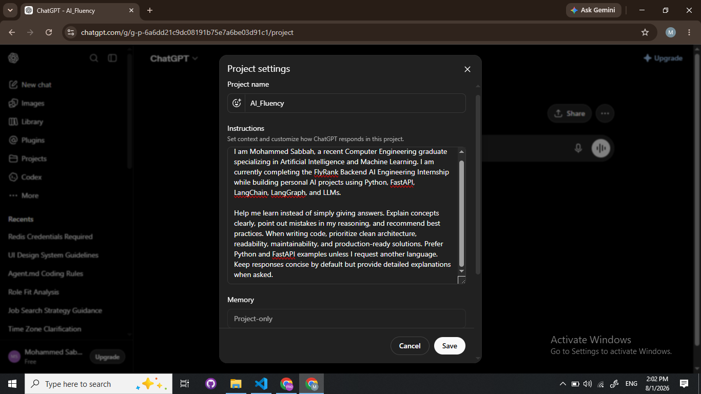

# FL-01: AI Workflow Audit and Tool Setup

**Assignment Code:** FL-01  
**Track:** General AI Fluency  
**Week:** 1  
**Phase:** Onboarding  

---

# AI Workflow Audit

This workflow audit reflects my recurring weekly tasks as a recent Computer Engineering graduate specializing in Artificial Intelligence and Machine Learning. The goal is to identify where AI improves my productivity, where it should assist me, and where I should complete the work independently.

| # | Weekly Task | Classification | Rationale |
|---|-------------|----------------|-----------|
| 1 | Implement FastAPI backend features for internship assignments | 🤝 Collaborate with AI | AI helps explain APIs, suggest implementations, and review code, while I write, test, and understand the final solution. |
| 2 | Debug Python, FastAPI, or Streamlit applications | 🤝 Collaborate with AI | AI identifies likely causes and proposes fixes, but I verify every solution through testing. |
| 3 | Learn new AI/ML concepts (RAG, LangGraph, LLMs, etc.) | 🤝 Collaborate with AI | AI provides explanations and examples, while I study and practice the concepts myself. |
| 4 | Read documentation for Python libraries and frameworks | 👀 Delegate to AI with Review | AI summarizes lengthy documentation, but I verify important implementation details using the official documentation. |
| 5 | Write GitHub README files and technical documentation | 👀 Delegate to AI with Review | AI creates a solid first draft that I review and personalize before publishing. |
| 6 | Prepare internship applications, cover letters, LinkedIn posts, and CV updates | 👀 Delegate to AI with Review | AI improves writing quality, while I ensure all information is accurate and reflects my experience. |
| 7 | Research AI frameworks, tools, and best practices | 🤝 Collaborate with AI | AI compares technologies efficiently, but I evaluate which ones best fit my projects. |
| 8 | Organize notes from research papers, videos, and technical articles | ⚙️ Fully Automate | AI can summarize and organize information into structured notes with minimal manual effort. |
| 9 | Generate practice quizzes and flashcards | ⚙️ Fully Automate | AI can automatically generate study material that I use for revision. |
|10| Design software architecture before implementation | 🤝 Collaborate with AI | AI suggests architecture patterns and alternatives while I make the final technical decisions. |
|11| Implement programming assignments and algorithms | 🙋 Just Me | Solving problems independently improves my programming skills and demonstrates my abilities. |
|12| Complete quizzes, exams, and graded assessments | 🙋 Just Me | Academic integrity requires that all graded work be completed independently. |

---

# AI Tool Setup

## Completed Setup

- ✅ ChatGPT account
- ✅ Claude account
- ✅ Anthropic Academy account
- ✅ Enrolled in **AI Fluency: Framework & Foundations**
- ✅ Completed the first module

---

# Claude Project

## Project Name

**AI_Fluency**

## Custom Instructions

> I am Mohammed Sabbah, a recent Computer Engineering graduate specializing in Artificial Intelligence and Machine Learning. I am currently completing the FlyRank Backend AI Engineering Internship while building personal AI projects using Python, FastAPI, LangChain, LangGraph, and LLMs.
>
> Help me learn instead of simply giving answers. Explain concepts clearly, identify mistakes in my reasoning, and recommend best practices. When writing code, prioritize clean architecture, readability, maintainability, and production-ready solutions. Prefer Python and FastAPI examples unless I request another language. Keep responses concise by default but provide detailed explanations when requested.

### Screenshot

---

# Target Tasks for FL-02 through FL-04

## 1. Debug Python and FastAPI Applications

### Success Definition

- Correctly identify the root cause.
- Produce a working solution.
- Explain why the fix works.
- Verify the fix through testing.
- No new bugs are introduced.

---

## 2. Write Technical Documentation (README)

### Success Definition

- Clear project overview.
- Accurate installation instructions.
- Usage examples included.
- Technologies documented correctly.
- Requires only minor edits before publishing.

---

## 3. Learn New AI and Machine Learning Technologies

### Success Definition

- Understand the core concepts.
- Explain the technology in my own words.
- Build a simple working example.
- Know when to use it and its limitations.

---

# Deliverables Checklist

- ✅ Workflow audit containing 12 recurring personal tasks
- ✅ Every task classified with a rationale
- ✅ Two tasks marked **Just Me**
- ✅ Claude Project configured with custom instructions
- ✅ Screenshot of Claude Project (`S1.png`)
- ✅ Three target tasks with measurable success definitions
- ✅ AI tool accounts configured
- ✅ Anthropic Academy enrollment completed

---

# Reflection

This audit helped me identify where AI provides the greatest value in my daily workflow. I found that AI is most useful for learning, documentation, debugging, and organizing information, while programming assessments and core problem-solving should remain my own responsibility. These three selected target tasks will serve as the foundation for improving my AI-assisted workflow throughout the remaining assignments in this track.